
 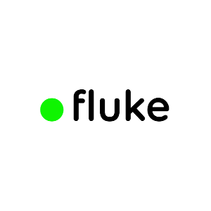

<h1 align="center">Teste para processo seletivo Fluke</h1>

# ✅ Descrição do Projeto

Aplicação mobile para compras controle do uso de dados, minutos e sms, me inspirei bastante na UI da prória Fluke, pesquisando videos de pessoas demonstrando e fotos no instagram da Fluke.
Foi uma experiência bem legal realizar este teste pois eu nunca havia trabalhado com React-Native, foi bastante desafiador. Valeu pela oportunidade, Fluke!

# ✅ Decisões e cronograma

Acabei gastando um dia completo nas intalações e configurações gerais que tive fazer para poder rodar o emulador (utilizei o Android Studio). Depois disso gastei mais 2 dias fazendo alguns estudos, entendendo como o React-Native funciona, lendo documentações e fazendo algumas atividades para treinar.
Quando de fato comecei a programar, decidi começar pela UI, construir todas as telas com dados fixos para depois começar a trabalhar com os dados e o gerenciamento de estado.

# ✅ Features

- [x] Login
- [x] Visualização do situação atual do pacote
- [x] Histórico de consumo
- [x] Fatura das compras realizadas no período
- [x] Compra de novos pacotes

# 📱 Telas

<h2 align="center">Login</h2>

 

Na tela de login, procurei fazer algo completo, mesmo que apenas o email de fato seja utilizado na aplicação, a senha é apenas obrigatória, mas se for digitado um caractere já funciona.

<h2 align="center">Home</h2>

 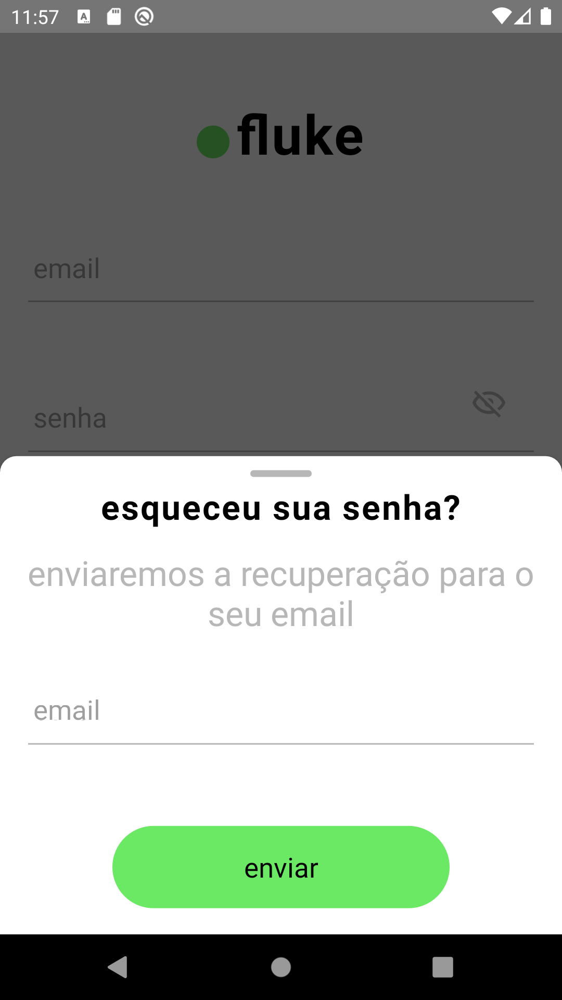

Ainda na tela de login, também fiz um modal dando a possibilidade do usuário realizar a recuperação de senha. Também é apenas visual.

 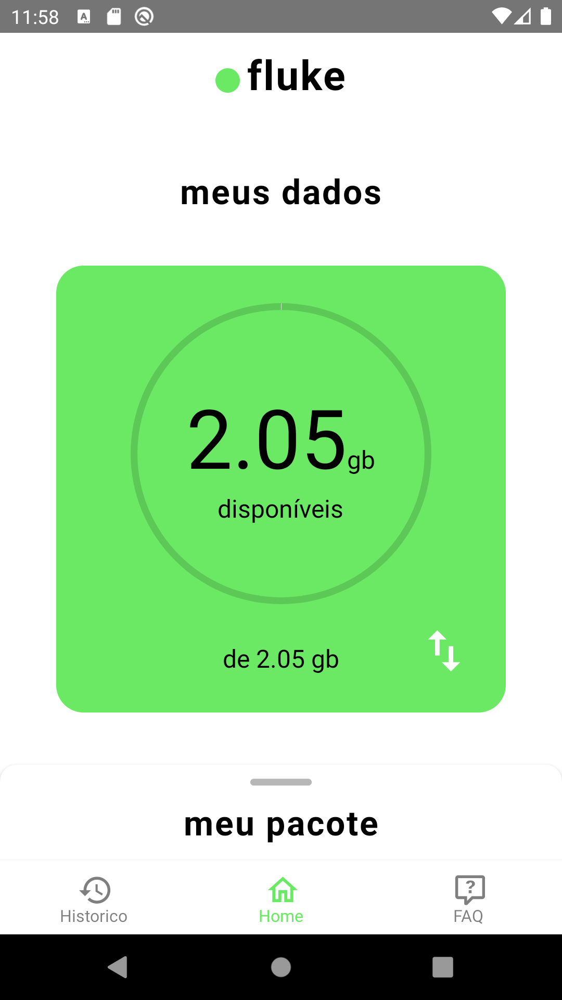

Após o login ser realizado, esta é a primeira tela que o usuário tem acesso, com uma visualização do momento atual de seu pacote, é possível alternar a visualização para os minutos clicando na seta branca. Para fazer isso utilizei conditional render.

 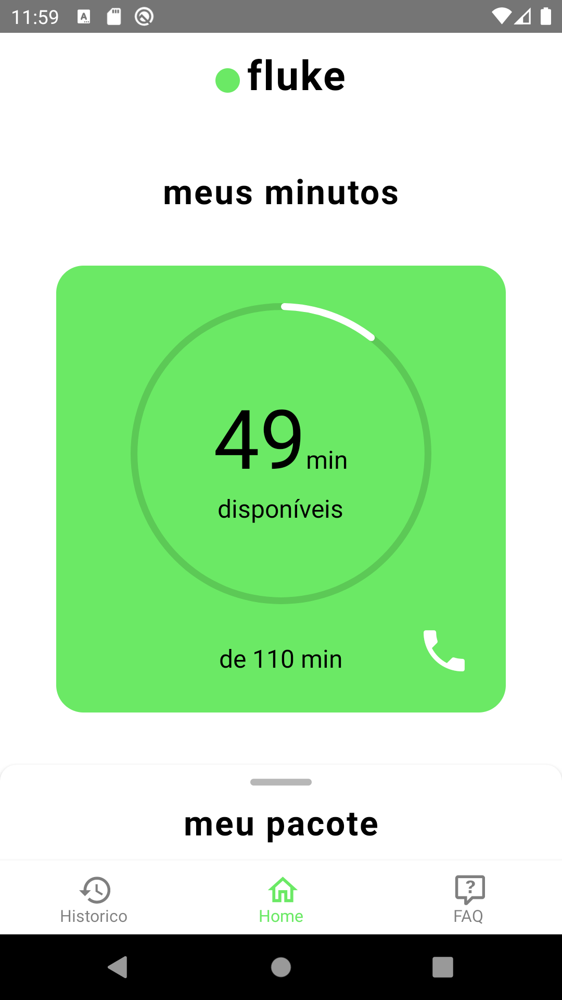

<h2 align="center">Fatura</h2>

 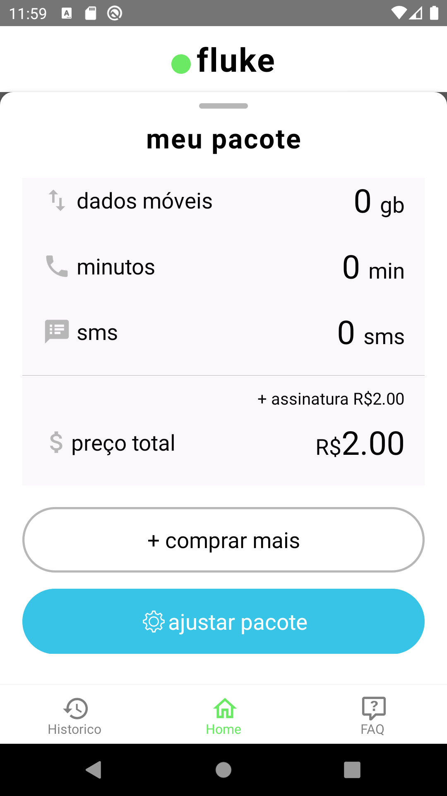

Nesta tela o usuário pode visualizar sua fatura no perído, estes dados só são validos durante o login, após o login eles são zerados. O botão de ajustar pacote não possui funcionalidade, o inclui apenas pela fidelidade na representação da UI da Fluke

<h2 align="center">Compra de Pacotes</h2>

 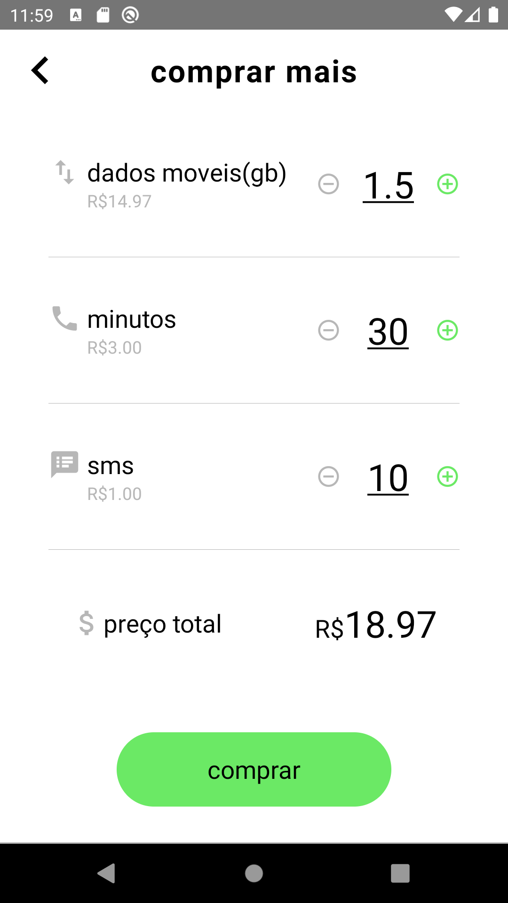

Na tela de compra de pacotes, o usuário pode visualizar quanto está comprando e quanto isso vai custar, após clicar em comprar os dados da fatura e da visualização do pacote são atualizados.

 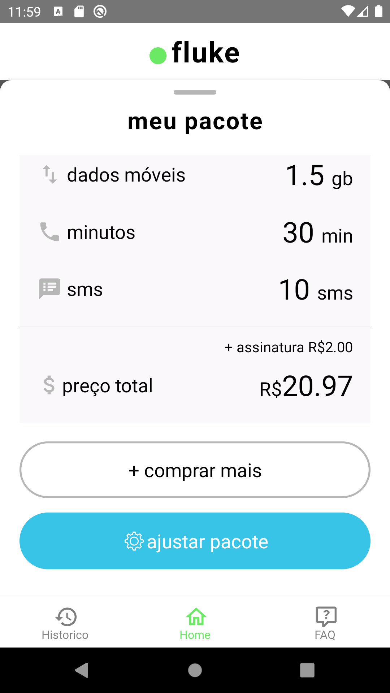

 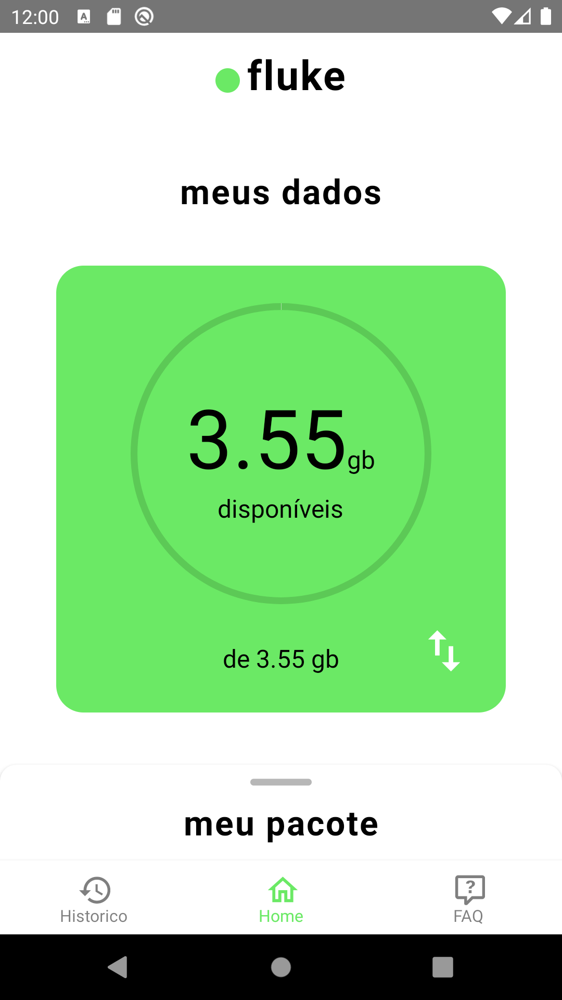

 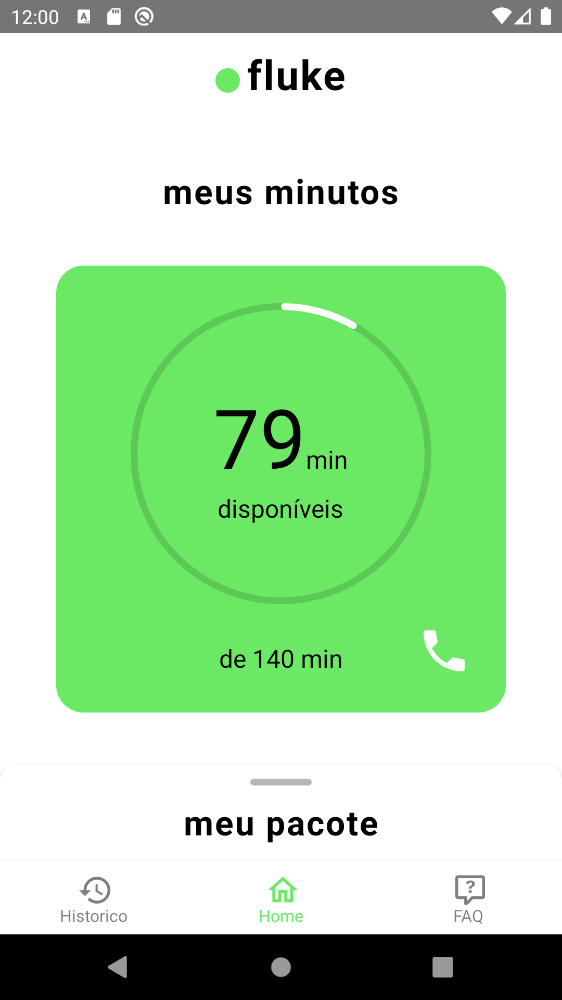

<h2 align="center">Histórico de Consumo</h2>

 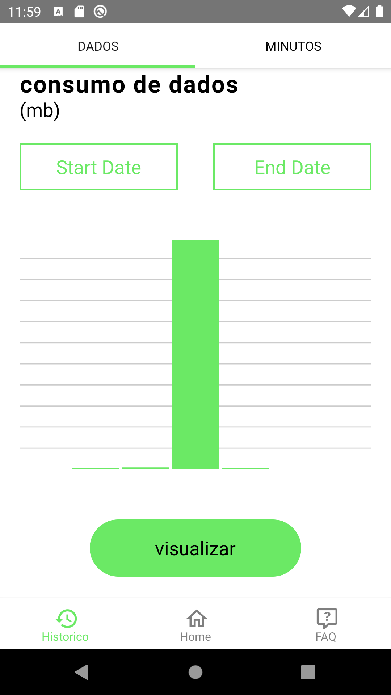

Nesta tela é possível visualizar o historíco de consumo de dados e minutos, inicialmente com 7 dias, mas podendo ser alterado ao pressionar os botões Start Date e End Date, e após escolhidas as datas, pressionar visualizar para os dados serem atualizados.

 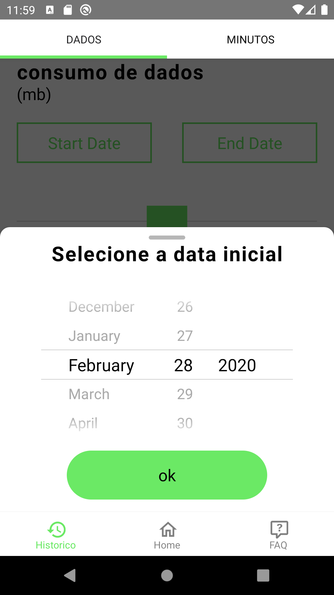

 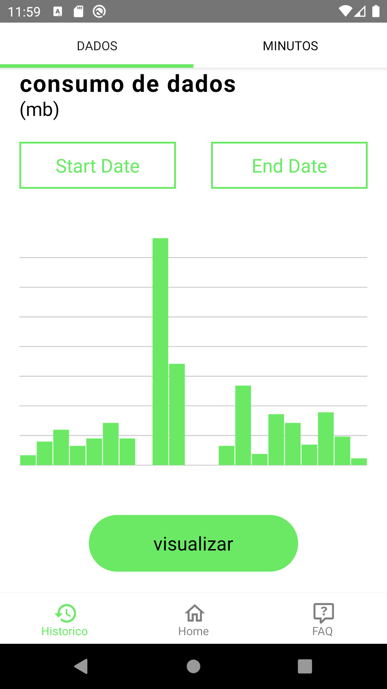

<h2 align="center">Perguntas Frequentes (FAQ)</h2>

 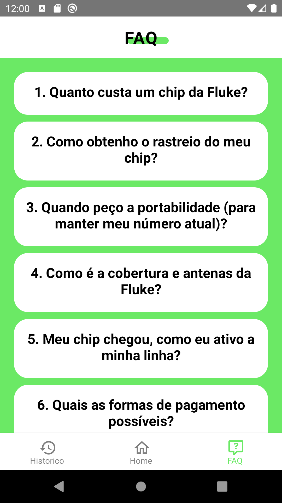

Nesta tela é possível visualizar as perguntas realizadas com maior frequencia, são varios accordions que, ao pressionados, se abrem exibindo as informações

 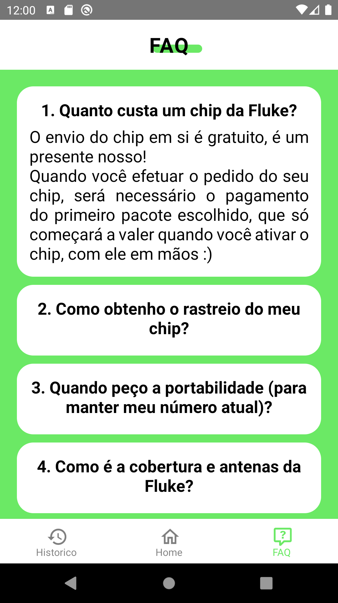

# 🛠 Tecnologias

- [React-Native](https://reactnative.dev/)
- [Redux](https://redux.js.org/)
- [React-Redux](https://react-redux.js.org/)
- [Axios](https://github.com/axios/axios)
- [Styled Components](https://styled-components.com/)
- [React Navigation](https://reactnavigation.org/)
- [React Hook Form](https://react-hook-form.com/)
- [Yup](https://github.com/jquense/yup)
- [Moment JS](https://momentjs.com/)
- [Modalize](https://jeremybarbet.github.io/react-native-modalize/#/)
- [React-Native-Date-Picker](https://github.com/henninghall/react-native-date-picker)
- [React-Native-Vector-Icons](https://github.com/oblador/react-native-vector-icons)
- [React-Native-Svg-Charts](https://github.com/JesperLekland/react-native-svg-charts)

# ✅ Status do Projeto

<h3 align="center"> 
    🚀 Concluído 🚀
</h3>

# 🖥️ Dev

- Made with ❤️ by [Cirineu Rodrigues](https://www.linkedin.com/in/cirineurodrigues/)
